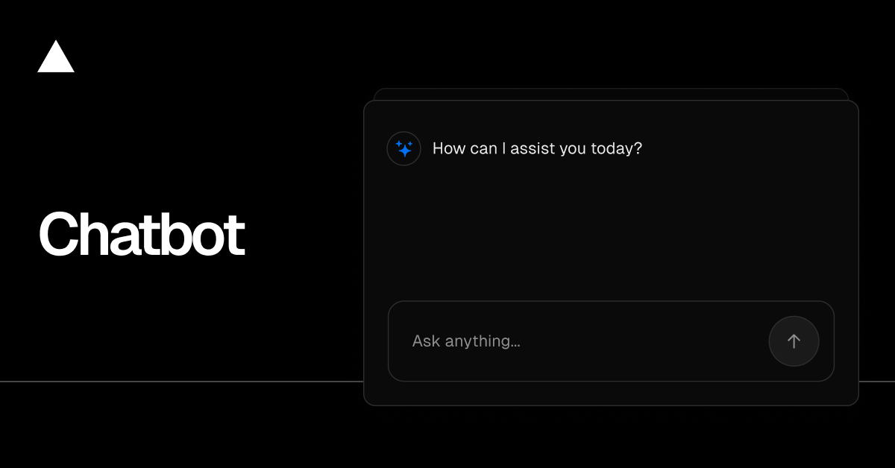

<a href="https://chatbot.ai-sdk.dev/demo">
  
  <h1 align="center">Chatbot</h1>
</a>

<p align="center">
    Chatbot (formerly AI Chatbot) is a free, open-source template built with Next.js and the AI SDK that helps you quickly build powerful chatbot applications.
</p>

<p align="center">
  <a href="https://chatbot.ai-sdk.dev/docs"><strong>Read Docs</strong></a> ·
  <a href="#features"><strong>Features</strong></a> ·
  <a href="#model-providers"><strong>Model Providers</strong></a> ·
  <a href="#deploy-your-own"><strong>Deploy Your Own</strong></a> ·
  <a href="#running-locally"><strong>Running locally</strong></a>
</p>
<br/>

## Features

- [Next.js](https://nextjs.org) App Router
  - Advanced routing for seamless navigation and performance
  - React Server Components (RSCs) and Server Actions for server-side rendering and increased performance
- [AI SDK](https://ai-sdk.dev/docs/introduction)
  - Unified API for generating text, structured objects, and tool calls with LLMs
  - Hooks for building dynamic chat and generative user interfaces
  - Sends chat completions directly to Groq with OpenAI-compatible requests
- [shadcn/ui](https://ui.shadcn.com)
  - Styling with [Tailwind CSS](https://tailwindcss.com)
  - Component primitives from [Radix UI](https://radix-ui.com) for accessibility and flexibility
- Data Persistence
  - [Neon Serverless Postgres](https://vercel.com/marketplace/neon) for saving chat history and user data
  - [Vercel Blob](https://vercel.com/storage/blob) for efficient file storage
- [Auth.js](https://authjs.dev)
  - Simple and secure authentication

## Model Providers

This app uses [Groq](https://groq.com) directly. Models are configured in `lib/ai/models.ts`, and every chat/title request goes through `lib/ai/providers.ts`.

### Groq Authentication

Set `GROQ_API_KEY` in `.env.local`. Optional `GROQ_BASE_URL` is supported by `lib/ai/providers.ts`.

## Deploy Your Own

You can deploy your own version of Chatbot to Vercel with one click:

[](https://vercel.com/templates/next.js/chatbot)

## Running locally

You will need to use the environment variables [defined in `.env.example`](.env.example) to run Chatbot.

> Note: You should not commit your `.env` file or it will expose secrets that will allow others to control access to your various AI and authentication provider accounts.

```bash
pnpm install
pnpm db:migrate # Setup database or apply latest database changes
pnpm dev
```

Your app template should now be running on [localhost:3000](http://localhost:3000).
